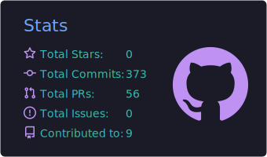
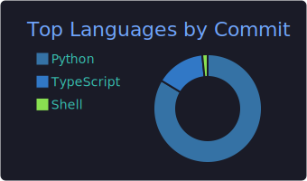

<!-- HERO BANNER (animated, light/dark aware) -->
<picture>
  <source media="(prefers-color-scheme: dark)" srcset="./assets/hero-dark.svg">
  
</picture>

 

> **Building AI agents you'd actually let near production.**
>
> Rules-engine verdicts over vibes. Audit trails over autocomplete. Working on that thesis across clinical decision-making, fundamental research, generative video, and household ops.

**2026:** the boring scaffolding that makes LLMs trustworthy — MCP servers, verdict systems, evaluation harnesses.

---

### Some of my projects

<table>
<tr>
<td width="50%" valign="top">

#### [Signal-Loop](https://github.com/AbhinavGupta707/Signal-Loop)
`python · MCP · FHIR`

Deterministic medication safety for AI prescribing agents. FHIR-native MCP servers with rules-engine verdicts — not "the model said it's fine."

</td>
<td width="50%" valign="top">

#### [Fundamental-Research-AutoPilot](https://github.com/AbhinavGupta707/Fundamental-Research-AutoPilot)
`python · SEC · research`

Autopilot for equity research: pulls SEC filings, scores 13 fundamental signals, stress-tests Buy candidates with bull/bear/forensic AI agents.

</td>
</tr>
<tr>
<td width="50%" valign="top">

#### [Video-Creation-Pipeline](https://github.com/AbhinavGupta707/Video-Creation-Pipeline)
`python · diffusion · 3D`

Skip the camera. Feed it AI stills + a reference video, it extracts the camera path and renders.

</td>
<td width="50%" valign="top">

#### [IMC-Prosperity](https://github.com/AbhinavGupta707/IMC-Prosperity)
`python · backtesting · quant`

Research-first trading framework — public replay data, backtesting harness, manual-round solvers.

</td>
</tr>
<tr>
<td width="50%" valign="top">

#### [Household-OS](https://github.com/AbhinavGupta707/Household-OS)
`typescript · mobile`

Mobile command center for running a modern Indian household. Less an app, more an operating system.

</td>
<td width="50%" valign="top">

#### [FoundersFactory](https://github.com/AbhinavGupta707/FoundersFactory)
`typescript`

In progress. Stay tuned.

</td>
</tr>
</table>

---

### By the numbers

<table>
<tr>
<td width="55%" valign="top">
  
</td>
<td width="45%" valign="top">
  
</td>
</tr>
</table>

<em>Stats card aggregates every public contribution I've made — commits, PRs, issues, stars, forks — across my repos and ones I've contributed to. Languages chart weights by actual commit volume, so what you see is where I spend keyboard time, not where my biggest checked-in files happen to live. Both regenerate daily via GitHub Actions.</em>

---

### Contribution skyline

  

---

&nbsp;&nbsp;<a href="https://github.com/AbhinavGupta707">github</a>
&nbsp;·&nbsp;<a href="mailto:">email</a>
&nbsp;·&nbsp;<a href="#">bluesky</a>
&nbsp;&nbsp; 
&nbsp;&nbsp;<em>this profile rebuilds itself daily via GitHub Actions</em>

