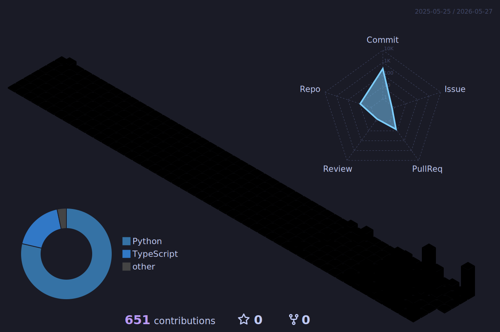

<!-- HERO BANNER (animated, light/dark aware) -->
<picture>
  <source media="(prefers-color-scheme: dark)" srcset="./assets/hero-dark.svg">
  
</picture>

 

> **Building deterministic AI agents for high-stakes domains** — medication safety, financial research, video pipelines, household ops.

**2026 focus:** shipping production-grade agent infrastructure — MCP servers, rules-engine verdicts, and the boring scaffolding that makes LLMs trustworthy.

---

### What I'm building right now

<table>
<tr>
<td width="50%" valign="top">

#### [Signal-Loop](https://github.com/abhinavgupta707/Signal-Loop)
`python · MCP · FHIR`

Deterministic medication safety for AI prescribing agents. FHIR-native MCP servers with rules-engine verdicts — not "the model said it's fine."

</td>
<td width="50%" valign="top">

#### [Fundamental-Research-AutoPilot](https://github.com/abhinavgupta707/Fundamental-Research-AutoPilot)
`python · SEC · research`

Autopilot for equity research: pulls SEC filings, scores 13 fundamental signals, then stress-tests Buy candidates.

</td>
</tr>
<tr>
<td width="50%" valign="top">

#### [Video-Creation-Pipeline](https://github.com/abhinavgupta707/Video-Creation-Pipeline)
`python · diffusion · 3D`

Skip the camera. Feed it AI stills + a reference video, it extracts the camera path and renders.

</td>
<td width="50%" valign="top">

#### [IMC-Prosperity](https://github.com/abhinavgupta707/IMC-Prosperity)
`python · backtesting · quant`

Research-first trading framework — public replay data, backtesting harness, manual-round solvers.

</td>
</tr>
<tr>
<td width="50%" valign="top">

#### [Household-OS](https://github.com/abhinavgupta707/Household-OS)
`typescript · mobile`

Mobile command center for running a modern Indian household. Less an app, more an operating system.

</td>
<td width="50%" valign="top">

#### [FoundersFactory](https://github.com/abhinavgupta707/FoundersFactory)
`typescript`

In progress. Stay tuned.

</td>
</tr>
</table>

---

### The shape of my work

<!-- lowlighter/metrics — produces the heatmap + radar chart you wanted -->

  

---

### Contribution skyline

<!-- yoshi389111/github-profile-3d-contrib — 3D isometric -->

  

---

&nbsp;&nbsp;<a href="https://github.com/abhinavgupta707">github</a>
&nbsp;·&nbsp;<a href="mailto:">email</a>
&nbsp;·&nbsp;<a href="#">bluesky</a>
&nbsp;&nbsp; 
&nbsp;&nbsp;<em>this profile rebuilds itself every 6 hours via GitHub Actions</em>

